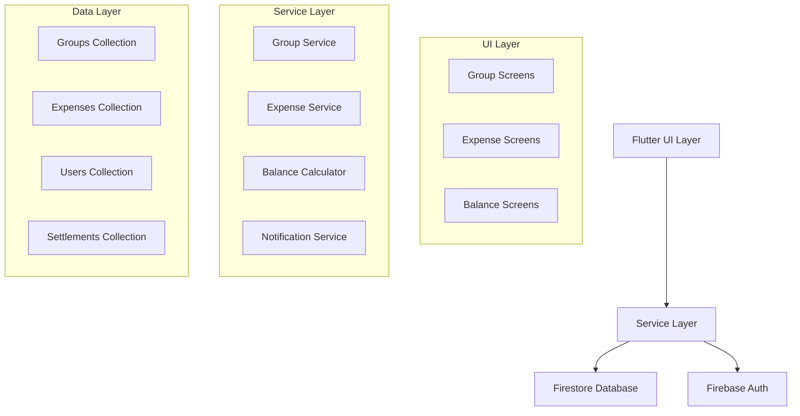

# Design Document

## Overview

The expense sharing system will be built as a Flutter application using Firestore as the backend database. The system follows a clean architecture pattern with clear separation between UI, business logic, and data layers. The design leverages Flutter's reactive programming model with Provider for state management and Firestore's real-time listeners for live updates.

The system will integrate with the existing authentication flow and user management, extending the current user model to support group memberships and expense tracking.

## Architecture

### High-Level Architecture



### Data Flow

1. **User Actions**: UI components trigger service methods
2. **Service Processing**: Services validate data and interact with Firestore
3. **Real-time Updates**: Firestore listeners push changes to all connected clients
4. **State Updates**: Provider notifies UI components of data changes
5. **UI Refresh**: Components rebuild with new data

## Components and Interfaces

### Core Models

#### Group Model

```dart
class Group {
  final String id;
  final String name;
  final String description;
  final String createdBy;
  final DateTime createdAt;
  final List<String> memberIds;
  final List<GroupInvitation> pendingInvitations;
  final double totalExpenses;
}
```

#### Expense Model

```dart
class Expense {
  final String id;
  final String groupId;
  final String description;
  final double amount;
  final String paidBy;
  final DateTime date;
  final ExpenseSplit split;
  final String createdBy;
  final DateTime createdAt;
}

class ExpenseSplit {
  final SplitType type; // equal, custom, percentage
  final Map<String, double> shares; // userId -> amount/percentage
}
```

#### Balance Model

```dart
class Balance {
  final String userId;
  final String groupId;
  final Map<String, double> owes; // userId -> amount owed to them
  final Map<String, double> owedBy; // userId -> amount they owe you
  final double netBalance;
}
```

#### Settlement Model

```dart
class Settlement {
  final String id;
  final String groupId;
  final String fromUserId;
  final String toUserId;
  final double amount;
  final DateTime settledAt;
  final String? note;
}
```

### Service Layer

#### GroupService

- `createGroup(Group group)`: Creates new group in Firestore
- `inviteMembers(String groupId, List<String> emails)`: Sends invitations
- `acceptInvitation(String invitationId)`: Adds user to group
- `getGroupsForUser(String userId)`: Returns user's groups
- `getGroupMembers(String groupId)`: Returns group member details

#### ExpenseService

- `addExpense(Expense expense)`: Creates new expense with split calculation
- `updateExpense(String expenseId, Expense expense)`: Updates existing expense
- `deleteExpense(String expenseId)`: Removes expense and recalculates balances
- `getExpensesForGroup(String groupId)`: Returns group expenses
- `calculateSplit(double amount, SplitType type, Map<String, dynamic> splitData)`: Calculates individual shares

#### BalanceService

- `calculateGroupBalances(String groupId)`: Computes all member balances
- `getUserBalance(String userId, String groupId)`: Gets specific user balance
- `simplifyDebts(List<Balance> balances)`: Optimizes debt relationships
- `recordSettlement(Settlement settlement)`: Records payment and updates balances

### UI Components

#### Screen Hierarchy

```
HomeScreen
├── GroupListScreen
│   ├── CreateGroupScreen
│   └── GroupDetailScreen
│       ├── AddExpenseScreen
│       ├── ExpenseDetailScreen
│       ├── BalanceScreen
│       └── SettleUpScreen
└── ProfileScreen
```

#### Key Widgets

- `GroupCard`: Displays group summary with balance preview
- `ExpenseListItem`: Shows expense details with split information
- `BalanceCard`: Displays debt/credit amounts with settle options
- `SplitCalculator`: Interactive widget for configuring expense splits
- `MemberSelector`: Multi-select widget for choosing expense participants

## Data Models

### Firestore Collections Structure

#### Groups Collection (`/groups/{groupId}`)

```json
{
  "id": "group_123",
  "name": "Vacation Trip",
  "description": "Summer vacation expenses",
  "createdBy": "user_456",
  "createdAt": "2025-01-15T10:00:00Z",
  "memberIds": ["user_456", "user_789"],
  "pendingInvitations": [
    {
      "email": "friend@example.com",
      "invitedBy": "user_456",
      "invitedAt": "2025-01-15T10:30:00Z",
      "status": "pending"
    }
  ],
  "totalExpenses": 450.75
}
```

#### Expenses Collection (`/expenses/{expenseId}`)

```json
{
  "id": "expense_123",
  "groupId": "group_123",
  "description": "Hotel booking",
  "amount": 300.0,
  "paidBy": "user_456",
  "date": "2025-01-15T14:00:00Z",
  "split": {
    "type": "equal",
    "participants": ["user_456", "user_789"],
    "shares": {
      "user_456": 150.0,
      "user_789": 150.0
    }
  },
  "createdBy": "user_456",
  "createdAt": "2025-01-15T14:05:00Z"
}
```

#### Settlements Collection (`/settlements/{settlementId}`)

```json
{
  "id": "settlement_123",
  "groupId": "group_123",
  "fromUserId": "user_789",
  "toUserId": "user_456",
  "amount": 150.0,
  "settledAt": "2025-01-16T09:00:00Z",
  "note": "Hotel payment settled"
}
```

#### Extended Users Collection

```json
{
  "uid": "user_456",
  "email": "user@example.com",
  "name": "John Doe",
  "avatarName": "avatar_1",
  "groups": ["group_123", "group_456"],
  "friends": ["user_789", "user_101"],
  "onboardingCompleted": true,
  "createdAt": "2025-01-10T08:00:00Z"
}
```

### Balance Calculation Algorithm

The system uses a debt simplification algorithm to minimize the number of transactions needed:

1. **Calculate Net Balances**: For each user, sum all amounts they owe minus amounts owed to them
2. **Separate Creditors and Debtors**: Split users into those who are owed money vs those who owe money
3. **Optimize Settlements**: Match debtors with creditors to minimize total transactions
4. **Generate Settlement Suggestions**: Provide users with optimal payment recommendations

## Error Handling

### Error Categories

#### Network Errors

- **Offline Mode**: Cache data locally and sync when connection restored
- **Timeout Errors**: Retry with exponential backoff
- **Connection Failures**: Show user-friendly error messages with retry options

#### Data Validation Errors

- **Invalid Amounts**: Prevent negative or zero expense amounts
- **Missing Required Fields**: Validate all required fields before submission
- **Duplicate Expenses**: Warn users about potential duplicate entries

#### Permission Errors

- **Unauthorized Access**: Verify user permissions for group operations
- **Firestore Rules**: Implement security rules to prevent unauthorized data access
- **Authentication Failures**: Handle token expiration and re-authentication

### Error Recovery Strategies

1. **Graceful Degradation**: Show cached data when real-time updates fail
2. **User Feedback**: Provide clear error messages with suggested actions
3. **Automatic Retry**: Implement retry logic for transient failures
4. **Offline Support**: Allow expense entry offline with sync when online

## Testing Strategy

### Unit Testing

- **Model Classes**: Test data validation and serialization
- **Service Methods**: Mock Firestore interactions and test business logic
- **Balance Calculations**: Verify debt simplification algorithms
- **Split Calculations**: Test various splitting scenarios

### Integration Testing

- **Firestore Operations**: Test real database interactions in development environment
- **Authentication Flow**: Verify user authentication and authorization
- **Real-time Updates**: Test Firestore listeners and state synchronization

### Widget Testing

- **Screen Navigation**: Test routing between different screens
- **Form Validation**: Verify input validation and error display
- **State Management**: Test Provider state updates and UI reactions
- **User Interactions**: Test tap, swipe, and input gestures

### End-to-End Testing

- **Complete User Flows**: Test full expense sharing workflows
- **Multi-user Scenarios**: Simulate multiple users interacting with same group
- **Edge Cases**: Test boundary conditions and error scenarios
- **Performance Testing**: Verify app performance with large datasets

## Security Considerations

### Firestore Security Rules

```javascript
rules_version = '2';
service cloud.firestore {
  match /databases/{database}/documents {
    // Users can only access their own user document
    match /Users/{userId} {
      allow read, write: if request.auth != null && request.auth.uid == userId;
    }

    // Group access restricted to members
    match /groups/{groupId} {
      allow read, write: if request.auth != null &&
        request.auth.uid in resource.data.memberIds;
    }

    // Expense access restricted to group members
    match /expenses/{expenseId} {
      allow read, write: if request.auth != null &&
        request.auth.uid in get(/databases/$(database)/documents/groups/$(resource.data.groupId)).data.memberIds;
    }
  }
}
```

### Data Privacy

- **Personal Information**: Encrypt sensitive user data
- **Group Isolation**: Ensure users can only access groups they belong to
- **Audit Trail**: Log all financial transactions for accountability
- **Data Retention**: Implement policies for data cleanup and user deletion
